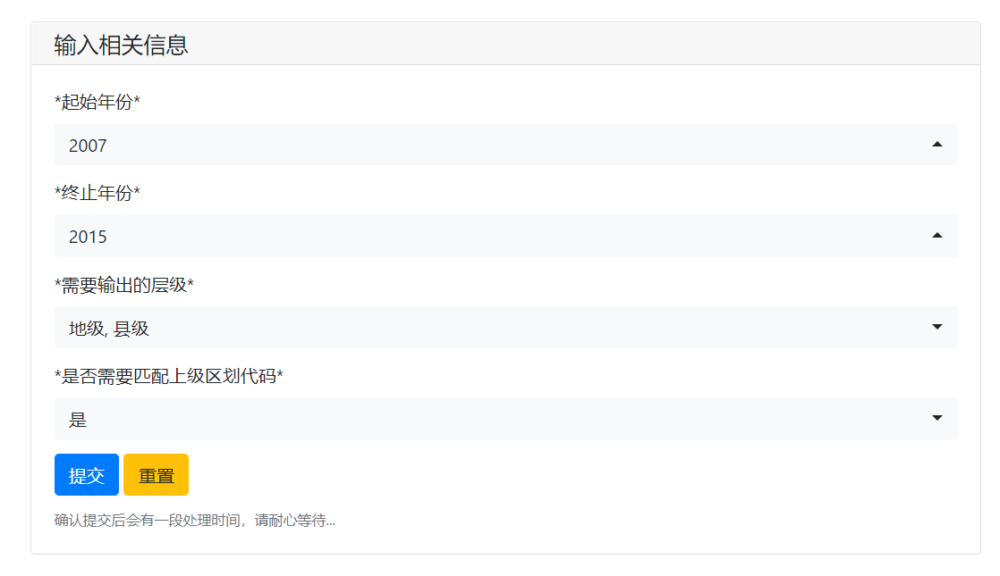
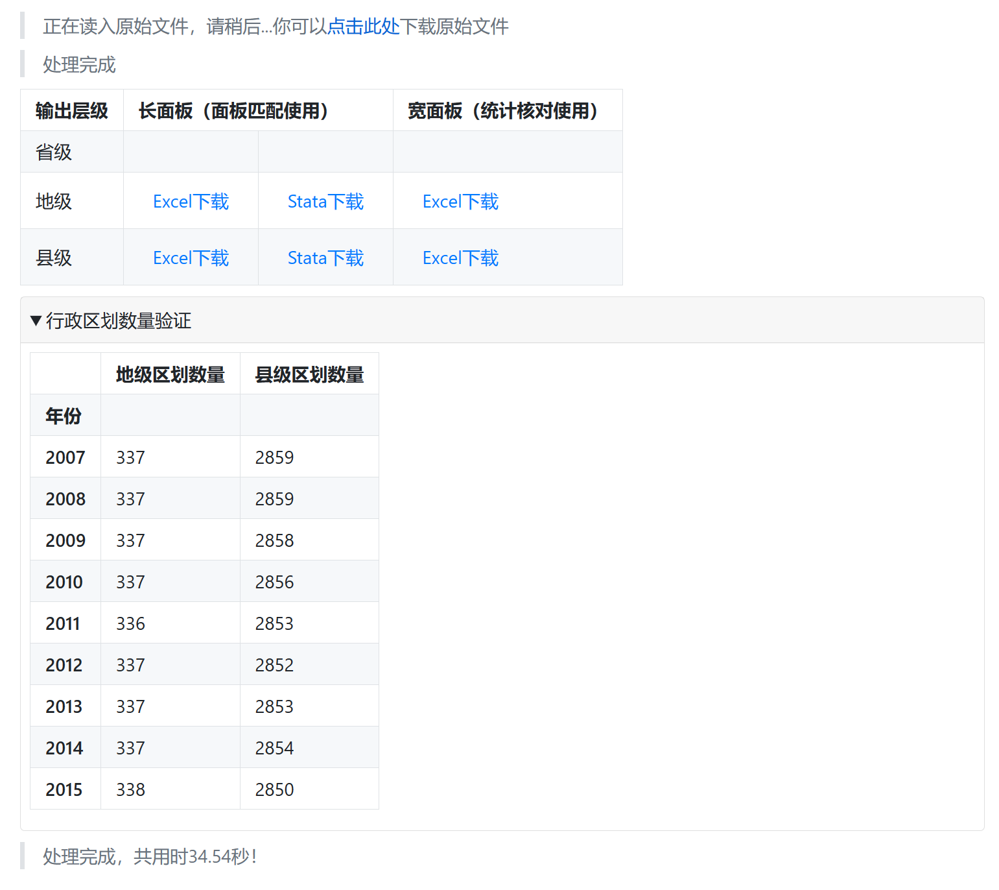

# 行政区划面板生成工具
    
本工具用于生成1980-2023年任意连续年份（≥1年）的行政区划名称与代码的长、宽面板，可与任何需要行政区划的数据匹配，可根据需要分层级下载，适用于不同的面板数据。
    
## 下载说明

- 请下载本仓库
- 安装依赖
    ```Python
    pip install pandas
    pip install numpy
    pip install pywebio==1.7.1
    pip install openpyxl
    # 或直接用pip install -r requirements.txt
    ```
- 执行qhlgpanel.py
    ```Python
    python qhlgpanel.py
    ```
- 浏览器输入：`http://127.0.0.1:9015`即可使用。（9015为默认端口，如需更改请在程序最后port部分修改为自己的端口）

## 使用说明
    
- 在输入区中选择`起始年份`，`终止年份`会自动根据`起始年份`调整。
- `需要输出的层级`中选择需要下载的层级，可选省级、地级或县级的任意组合，根据科研经验，本工具中的地级包括直辖市。
- 如果需要匹配上级行政区划代码，则在`是否需要匹配上级区划代码`中选择`是`，如不需要，请选择`否`。注意如果仅选择`省级`，则`是否需要匹配上级区划代码`只能选择`否`。
- 选择提交。若需要重新选择请选择`重置`或刷新页面。
- 结果输出后请尽快下载，刷新页面将导致链接失效。统计得到的行政区划数量可与民政部历年统计资料比对。
- `长面板`一般用于面板数据的匹配，`宽面板`为二维表格，核对查补更为直观。例如：

    - 长面板（Long Form）示例

        | 区划代码 | 年份 | 区划名称 |
        | :------: | :------: | :-------: |
        | 110000 | 2014 | 北京市 |
        | 110000 | 2015 | 北京市 |
        | 120000 | 2014 | 天津市 |
        | 120000 | 2015 | 天津市 |
        | …… | ……| ……|

    - 宽面板（Wide Form）示例

        | 区划代码 | 2014 | 2015 |
        | :------: | :------: | :-------: |
        |110000 | 北京市 | 北京市 |
        |120000 | 天津市 | 天津市 |
        |…… | …… | …… |

- 图示：

    
    

    


## 数据来源

- 原始数据来自于`统计年鉴`公众号
- 在此基础上对部分错误进行了调整，并将数据更新至2023年
- [民政部历年行政区划代码](http://www.mca.gov.cn/article/sj/xzqh/1980/)  |  [民政部历年行政区划统计](http://xzqh.mca.gov.cn/statistics/)

## 源代码

- 本程序的源代码：详见本仓库

- 查看Stata预处理命令：

    ```
    destring *代码 年份, replace
    local varlist "县级区划代码 年份 县级区划名称 县级区划类型 地级区划代码 地级区划名称 地级区划简称 省份代码 省级区划名称 省级区划简称"
    foreach var of local varlist{
        cap label var `var' `var'
    }

    cap rename 县级区划代码 xzqhdm_county
    cap rename 县级区划名称 xzqhmc_county
    cap rename 县级区划类型 xzqhlx_county
    cap rename 地级区划代码 xzqhdm_city
    cap rename 地级区划名称 xzqhmc_city
    cap rename 地级区划简称 xzqhjc_city
    cap rename 省份代码 xzqhdm_prov
    cap rename 省级区划名称 xzqhmc_prov
    cap rename 省级区划简称 xzqhjc_prov
    cap rename 年份 year

    compress
    ```