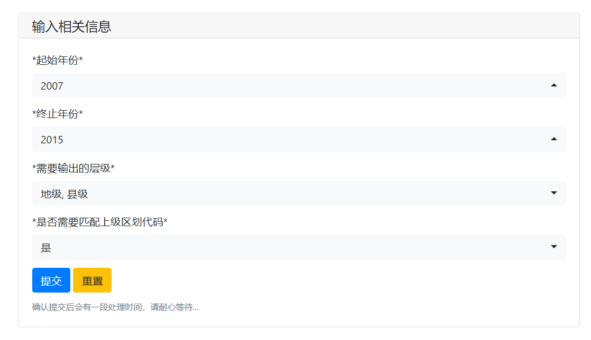
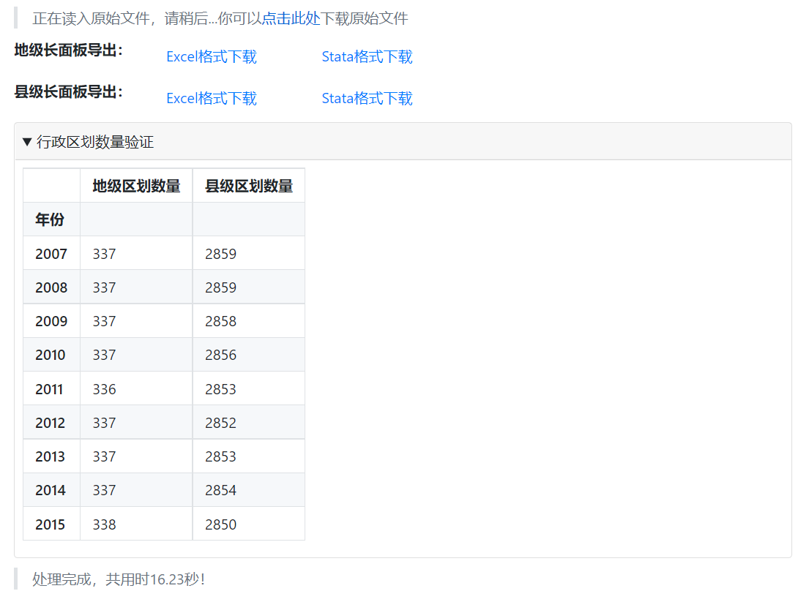

# 行政区划面板生成工具
    
本工具用于生成1980-2021年任意连续年份（≥1年）的行政区划名称与代码的长面板，可与任何需要行政区划的数据匹配，可根据需要分层级下载，适用于不同的面板数据。

## 使用说明

- 在输入区中选择`起始年份`，`终止年份`会自动根据`起始年份`调整。
- `需要输出的层级`中选择需要下载的层级，可选省级、地级或县级的任意组合，根据科研经验，本工具中的地级包括直辖市。
- 如果需要匹配上级行政区划代码，则在`是否需要匹配上级区划代码`中选择`是`，如不需要，请选择`否`。注意如果仅选择`省级`，则`是否需要匹配上级区划代码`只能选择`否`。
- 选择提交。若需要重新选择请选择`重置`或刷新页面。
- 统计得到的行政区划数量可与民政部历年统计资料比对。

## Demo

假设需要`2007-2015年`的地级和县级行政区划代码，并需要匹配好上级行政区划代码，则：

- `起始年份`选择`2007`
- `终止年份`选择`2015`
- `需要输出的层级`选择`地级`和`县级`
- `是否需要匹配上级区划代码`选择`是`

确认提交后等待10-20秒左右，分别输出`匹配好省级代码的地级行政区划`和`匹配好地级和省级代码的县级行政区划`，格式分别为`xlsx`和`dta`，可以选择需要的格式下载。

## 数据来源

- 原始数据来自于`统计年鉴`公众号
- 在此基础上对部分错误进行了调整，并将数据更新至2021年
- [民政部历年行政区划代码](http://www.mca.gov.cn/article/sj/xzqh/1980/)  |  [民政部历年行政区划统计](http://xzqh.mca.gov.cn/statistics/)

## 源代码
本程序的源代码：[Gitee](https://gitee.com/czhweb/qhlgpanel/blob/master/qhlgpanel.py)
    

